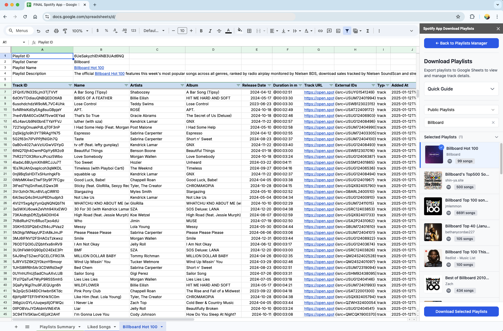

# Spotify Playlists Manager for Google Sheets

A Google Apps Script project that allows you to manage your [Spotify](https://open.spotify.com/) playlists directly from [Google Sheets](https://sheets.google.com/).

<p align="center"></p>

## Features

- Download playlists from your Spotify library to Google Sheets
- Search and download public playlists
- Update existing playlists by adding, removing and reordering tracks
- Create new private playlists
- Manage 'Liked Songs' library

## Prerequisites

- Google Account
- Spotify Account
- Spotify Developer Account (for API credentials)

## Setup

1. Create a new Google Sheet at [sheets.google.com](https://sheets.google.com/)
2. Open Apps Script Editor ("Extensions" > "Apps Script")
3. In the Apps Script Editor, create these files with the same name and in lower case

   Script files (`.gs`):
   ```
   config
   core
   operations
   sheets
   ui
   ```

   HTML files (`.html`):
   ```
   user_guide
   setup_guide
   playlists_manager
   download_playlists
   update_playlists
   create_playlists
   error
   ```
4. Copy-paste the file contents from this GitHub repo into the respective files
5. Once saved, refresh your Google Sheet to see the "🎵 Spotify Playlists Manager" menu
6. Click on the "🎵 Spotify Playlists Manager" menu, and follow the steps to authorize the Apps Script project
7. Follow the "ℹ️ User Guide" menu to understand the features
8. Follow the "🛠️ Setup Guide" menu to:
   - Create Spotify API credentials
   - Add OAuth2 library
   - Authorize the application
9. Once authorized and connected to Spotify API, you can use the "Playlists Manager" menu to easily manage your playlists

## Project Structure

- `config.gs`: Configuration constants and user settings
- `core.gs`: Core Spotify API functionality and authentication
- `operations.gs`: Playlist management
- `sheets.gs`: Google Sheets operations
- `ui.gs`: UI components and event handlers
- HTML files: Web interfaces for different features

## Usage

1. **Playlists Summary**
   - Click on "Get Summary" to see all your playlists info

2. **Download Playlists**
   - Select your playlists or search public playlists to download
   - View detailed track information in sheets

3. **Update Playlists**
   - Add/remove tracks using Track IDs
   - Reorder tracks by moving rows
   - Click "Update Playlist" to sync changes

4. **Create Playlists**
   - Name your playlist
   - Add description (optional)
   - Add tracks in the new sheet
   - Use "Update Playlists" option to upload tracks

## Customization

To customize the script, modify the values in the `USER_CONFIG` constant located in the `config.gs` file:
- `fontSize`: Set the default font size
- `defaultFont`: Set the default font
- `hideMetadataRows`: Hide the metadata rows at the top of each playlist
- `summarySheetName`: Name of the Playlists Summary sheet
- `savedTracksName`: Name for user's 'Liked Songs'
- `savedTracksDesc`: Description for user's 'Liked Songs'

## Limitations

- Maximum 10,000 tracks per playlist (Spotify limit)
- Cannot download Spotify algorithmic/editorial playlists
- To update Public playlists, you will need to be added as a collaborator
- The Google Apps Script project may experience slow performance due to platform limitations
- Spotify API rate limits may impact performance for large playlists or frequent syncing
- A Google Apps Script run times out in 6 minutes

## Dependencies

- OAuth2 library for Google Apps Script
- Spotify Web API
- TailwindCSS (via CDN)

## Contributing

1. Fork the repository
2. Create a feature branch
3. Submit a pull request

## License

MIT License

## Author

[schantanu](https://github.com/schantanu)